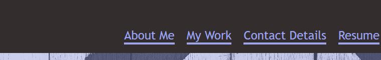
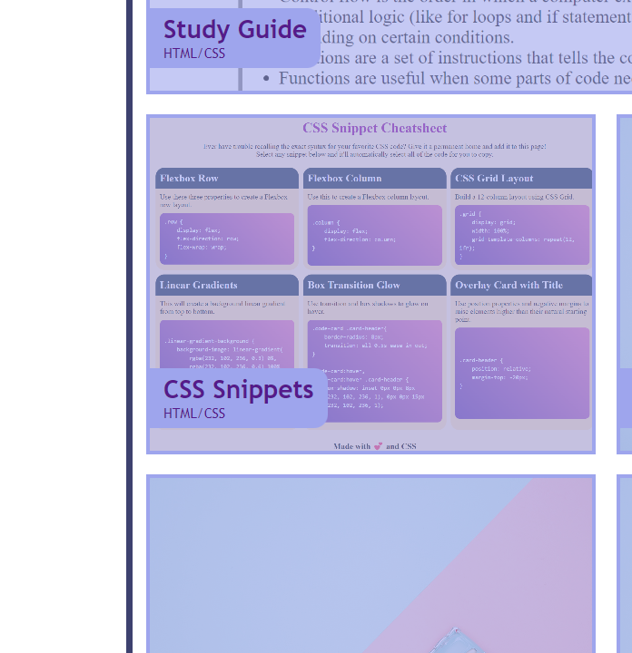

# Portfolio Landing Page

## Description

This project is for creating a landing page for my portfolio. The portfolio contains a brief introduction about myself and showcases all the web development work I have done so far. All my deployed web applications can be accessed through this landing page.

The following list describes the different sections of the portfolio page:

* Top of the page consists of my full name and my profile picture with some navigation links. These links can be used to go directly to different sections of my web page.

* The 'Resume' link is used to download my latest Resume.

* First section of my web page is the 'About Me' section which contains a brief introduction about myself.

* Second section is the 'Work' section which displays a list of all my web development work in the form of titled images. These images provide a link to my corresponding deployed web applications. I have only provided links to two applications. The rest of them are just placeholders for my future applications that I will be building.

* The last sections contains my contact details like phone number, email id and a link to my LinkedIn profile

* The phone number and email id text can be easily selected with one click to copy to clipboard and be used.

* The web page has also been made responsive to be displayed on different screen sizes.

## Installation

The application can be accessed at the following website:

https://jayapk21.github.io/portfolio-landing-page/

## Usage

When you go to the website it will look like the following image.

Click on the navigation links below to go to different sections of the web page.

Click on one of the work links to go to the corresponding deployed web application.

Website at maximum width of 830px.

Website at maximum width of 600px.
 

Website at maximum width of 480px.
 
